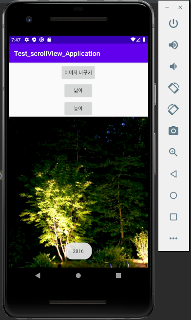

# 19273019 유혜신
Hello My name is YuHyeshin

## 1주차과제
퀴즈로 제출
 
 ## 2주차과제
  [네이버](https://naver.com "네이버")
  
 1. 첫번째
 
 2. 두번째
 
 3. __세번째__
 

 
  ## 3주차과제

  ## 4주차과제
   아이디어명: 음식점 예약 어플리케이션
   
   해당 어플리케이션에 등록된 음식점은 모두 예약이 가능하며(당일 예약 가능)
   현재 그 음식점에서 사람들이 얼마나 줄 서있는지 자리가 남았는지 가보지 않아도 한눈에 알수 있다.
   실시간으로 업데이트 되며
   
   그리고 고객의 휴대전화 번호로 예약시 
   예약시간 10분전에 미리 통보 받는다.
   
   기획 배경: 
   배X의 민족,요A요 등 우리집으로 배달오는 많은 음식점들은 많으나
   반대로 우리가 음식점을 가야할때 프렌차이저를 제외한 동네의 음식점들은
   현재 손님들이 많아 대기줄이 긴지, 몇인용 자리는 비어있는지 가보지 않으면 알기 어렵다.
   또한 전화로 이야기 한들 유명한 음식점, 혹은 꽉찬 음식점이라면 음식점 마다 여러번 전화해야하는 번거로움이 있다.
   
   결론: 전화하거나 줄서지 말고 바로바로 자리가 있는 음식점을 알수있다.
   
   ## 7주차과제
   
   깃허브 제출 할사람/안할사람 각각 제출
   안드로이드 스튜디오 사용자계정 영어로 재설치
   
   
   
   # 7주차 xml 소스코드 백업용
   <?xml version="1.0" encoding="utf-8"?>
<LinearLayout xmlns:android="http://schemas.android.com/apk/res/android"
    xmlns:app="http://schemas.android.com/apk/res-auto"
    xmlns:tools="http://schemas.android.com/tools"
    android:layout_width="match_parent"
    android:layout_height="match_parent"
    android:orientation="vertical"
    tools:context=".MainActivity">

    <Button
        android:id="@+id/button"
        android:layout_width="wrap_content"
        android:layout_height="wrap_content"
        android:layout_gravity="center"
        android:layout_marginTop="50dp"
        android:onClick="onButton"
        android:text="이미지 바꾸기" />
    <FrameLayout
        android:layout_width="match_parent"
        android:layout_height="match_parent"
        >
        <ImageView
            android:id="@+id/image"
            android:layout_width="wrap_content"
            android:layout_height="wrap_content"
            android:visibility="invisible"
            app:srcCompat ="@drawable/pic1"
            />
        <ImageView
            android:id="@+id/image2"
            android:layout_width="wrap_content"
            android:layout_height="wrap_content"
            android:visibility="visible"
            app:srcCompat ="@drawable/pic2"
            />

        <TextView
            android:id="@+id/textView"
            android:layout_width="149dp"
            android:layout_height="38dp"
            android:text="19273019유혜신" />
    </FrameLayout>
</LinearLayout>

# 7주차 java 소스코드 백업용
package com.example.imageview_testapplication;

import androidx.appcompat.app.AppCompatActivity;

import android.os.Bundle;
import android.view.View;
import android.widget.ImageView;

public class MainActivity extends AppCompatActivity {
    ImageView i;
    ImageView i1;

    int imageIndex = 0;

    @Override
    protected void onCreate(Bundle savedInstanceState) {
        super.onCreate(savedInstanceState);
        setContentView(R.layout.activity_main);
        i = findViewById(R.id.image);
        i1 = findViewById(R.id.image2);
    }
    public void onButton(View v){
        changeImage();
    }
    private void changeImage(){
        if (imageIndex == 0){
            i.setVisibility(View.VISIBLE);
            i1.setVisibility(View.INVISIBLE);
            imageIndex = 1;
        }
        else if (imageIndex == 1){
            i.setVisibility(View.INVISIBLE);
            i1.setVisibility(View.VISIBLE);
            imageIndex = 0;
        }
    }
}

 ## 9주차과제
    이미지 바꾸기 전
   
    
    넓이
   
    높이
   
   
 ## 10주차과제
 처음 나오는 부분
 
 
 
 글자수 바이트 나오는 부분
 
 
 
 ## 11주차과제
 처음 나오는 부분
 
 
 
 글자수 바이트 나오는 부분
 
 
 
 ## 12주차과제
 
 
 
 ## 13주차 ~14주차 +기말
 데이터 링크 = 휴게소별 맛난 음식
